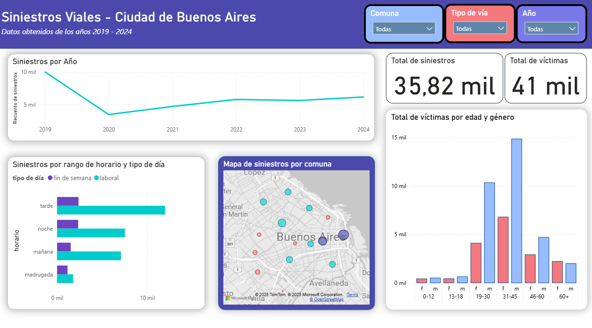

# 📊 Siniestros Viales – Ciudad de Buenos Aires  

Este proyecto aborda el análisis de **siniestros viales en la Ciudad de Buenos Aires (2019 – 2024)**, cubriendo el proceso completo:  
- **Limpieza y preparación de datos** con Python.  
- **Análisis exploratorio** de variables clave.  
- **Visualización interactiva** mediante Power BI.  

El objetivo principal es generar datos limpios y consistentes para identificar patrones, comprender la distribución temporal y geográfica de los accidentes, y evaluar el impacto en las víctimas.  

---

## 🔎 Contenido del repositorio  
- `datasets/raw/` → datos originales.  
- `datasets/processed/` → datos limpios y listos para análisis.  
- `notebooks/` → Jupyter Notebooks con el proceso de limpieza paso a paso.  
- `requirements.txt` → librerías utilizadas (pandas, numpy, etc.).  
- `power_bi/reporte_siniestros_viales.pbix` → reporte interactivo en Power BI.  

---

## 📂 Dataset  
- Fuente: [Datos Abiertos de la Ciudad de Buenos Aires](https://data.buenosaires.gob.ar/dataset/victimas-siniestros-viales).  
- Período: **2019 – 2024**.  
- Variables principales:  
  - Año del siniestro  
  - Comuna  
  - Tipo de vía  
  - Franja horaria  
  - Tipo de día (laboral / fin de semana)  
  - Edad y género de las víctimas  

---

## 🛠️ Herramientas utilizadas  
[](https://www.python.org/)  
[](https://pandas.pydata.org/)  
[](https://numpy.org/)  
[](./power_bi/reporte_siniestros_viales.pbix)  

---

## 🎯 Objetivos del proyecto  
✔️ Realizar **data cleaning** para asegurar consistencia y calidad en los datos.  
✔️ Analizar la evolución de los siniestros por año y por franja horaria.  
✔️ Identificar las comunas más afectadas.  
✔️ Examinar la distribución de víctimas por edad y género.  
✔️ Desarrollar un dashboard interactivo para exploración de insights.  

---

## 📊 Dashboard – Visualizaciones principales y Conclusiones 

- **Siniestros por Año** → evolución anual con caída marcada en 2020 debido a la cuarentena por Covid-19 y leve recuperación en los años posteriores.  
- **Siniestros por Rango Horario y Tipo de Día** → mayor concentración en **la tarde**, especialmente en días laborales, probablemente debido a la hora pico.  
- **Mapa por Comuna** → muestra la concentración de accidentes en las distintas comunas de la ciudad.  
- **Indicadores Clave**:  
  - Total de siniestros: **35,82 mil**  
  - Total de víctimas: **41 mil**  
- **Víctimas por Edad y Género** → predominio en **hombres de 19 a 45 años**.  

---

## 🚀 Cómo visualizar el proyecto  
1. Clonar este repositorio:  
   ```bash
   git clone https://github.com/usuario/proyecto-siniestros-viales.git
2. Abrir el archivo .pbix con Power BI Desktop.

## 📬 Contacto
LinkedIn: www.linkedin.com/in/loredana-bejarano

GitHub: www.github.com/loreB02

Email: loredana.bejarano@gmail.com
